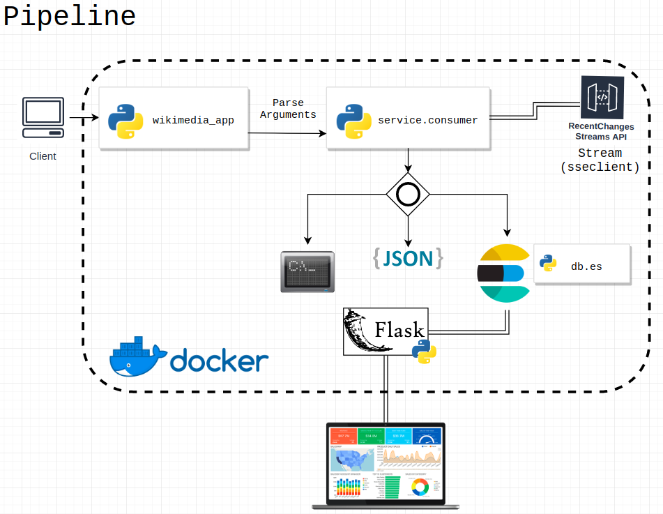
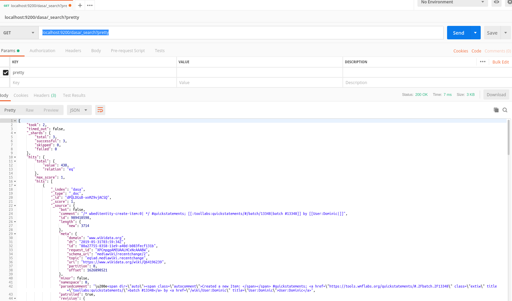

# Wikimedia Stream App

## Purpose:
This repo aims to create a simple data stream pipeline with Python (and other things), including getting data streams from Wikimedia [Recent Changes API](https://wikitech.wikimedia.org/wiki/Event_Platform/EventStreams), processing and persisting them to DataViz.

To acomplish this, the following tasks were executed:

### Task 1: Planning

#### Design Considerations
- The application follows the simplest way to complete tasks, considering the time given to finish.
- In order to get data from API, the SSEClient were used as described in the Wikimedia Recent Changes documentation suggests. 
- Elasticsearch were used due to the nature of the data. This kind of streams can be considered as events that generates documents (json), which is a natural data to Elasticsearch.  It is scable, very fast with full text search in documents and very good to analytics workloads. MongoDB would be a candidate to store this json documents, but manage mongoDB clusters is not so easy, at least, considering what I've heard :)
- In the backend a flask server interact with Elasticsearch querying data requested from dashboard.
- DataViz were produced with standard web tools using material design, which I personally appreciate.
- A docker compose file construct environment with flask and elasticsearch.

#### Strength's and Weaknesses
- Storage is scalable in Elasticsearch cluster
- Dashboard has little self-service features. Kibana would be a interesting DataViz layer to present Elasticsearch data
- Just one python process to deal with all messages could cause event loss. Some fastdata tool could be used instead, as flume, spark streaming, even kafka.

#### Pipeline




### Task 2: Getting data

Initially data were collect from Wikimedia Recent Changes API through a python application (wikimedia_app).
This application uses the service Consumer which collect streams of messages from API and then write these data to some user option (console, json file or persist them into Elasticsearch) - Task 3. 

Diagram:


### Task 3: Persist data

- Verify Elasticsearch instance

``` shell
curl -X GET localhost:9200/
{
  "name" : "aaf67203e99f",
  "cluster_name" : "docker-cluster",
  "cluster_uuid" : "ex3iSq5uQDW1qmq20Tvvvg",
  "version" : {
    "number" : "7.1.0",
    "build_flavor" : "default",
    "build_type" : "docker",
    "build_hash" : "606a173",
    "build_date" : "2019-05-16T00:43:15.323135Z",
    "build_snapshot" : false,
    "lucene_version" : "8.0.0",
    "minimum_wire_compatibility_version" : "6.8.0",
    "minimum_index_compatibility_version" : "6.0.0-beta1"
  },
  "tagline" : "You Know, for Search"
}
```
- Creating index

``` python
    python initdb.py
```

- Persist stream

``` python
python wikimedia_app.py --mode=persist
```
- See data persisted

``` shell
curl -H 'Content-Type: application/json' -XGET localhost:9200/dasa/_search?pretty
```

Postman:



### Task 4: DataViz


## Running Application