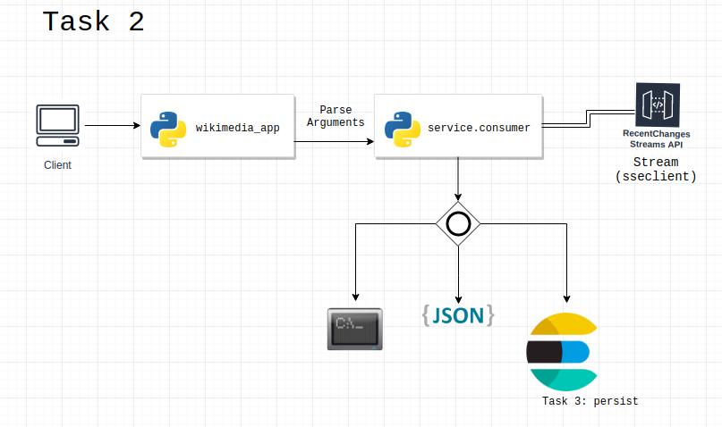

# Wikimedia Stream App

## Purpose:
This repo aims to create a simple data stream pipeline with Python (and other things), including getting data streams from Wikimedia [Recent Changes API](https://wikitech.wikimedia.org/wiki/Event_Platform/EventStreams), processing and persisting them to DataViz.

To acomplish this, the following tasks were executed:

### Task 1: Planning

### Task 2: Getting data

Initially data were collect from Wikimedia Recent Changes API through a python application (wikimedia_app).
This application uses the service Consumer which collect streams of messages from API and then write these data to some user option (console, json file or persist them into Elasticsearch) - Task 3. 

Diagram:

### Task 3: Persist data

